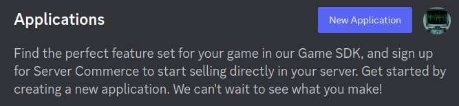
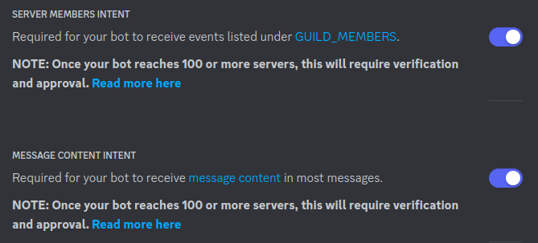
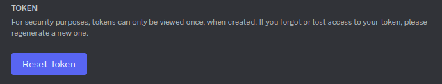
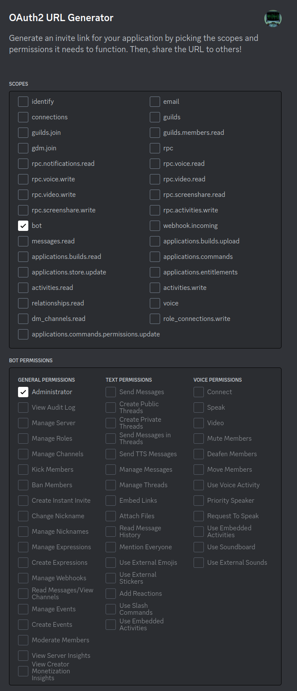

# Installation

## MongoDB

To install the database needed for this project, utilize the following guide.

[MongoDB Guide](https://www.mongodb.com/docs/manual/administration/install-community/)

Ensure that the service is running with:

* Ubuntu
    * `sudo systemctl status mongodb`

## Creating Discord Application

1. Create a new application in Discord and obtain an API key for your bot. There are plenty of online tutorials available to guide you through this process.
    * [Dev Portal](https://discord.com/developers/)

2. Create the new application using the button in the upper right corner of the webpage.

3. Enable access to `Servers Members Intent` and `Message Content Intent`

4. Pull token from the bot tab, copy this and use this in the config file.

5. Build the URL

6. Copy the URL and paste it into your browser and select your desired server.